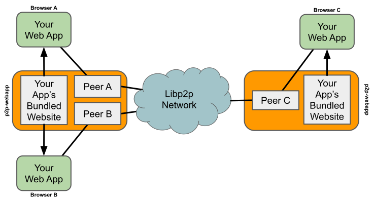

# Build Peer-to-Peer Web Apps in Minutes

**p2p-webapp** lets you build real-time, double-clickable, peer-to-peer web applications with just JavaScript. No backend servers. No hosting costs. No signaling servers. No complex setup.

```typescript
// Connect to a peer-to-peer chat room in 3 lines
const client = await connect();
await client.subscribe('my-chat-topic', (peerID, data) => showMessage(data.text));
await client.publish('my-chat-topic', { text: 'Hello, P2P world!' });
```

## What is p2p-webapp?

**p2p-webapp** is a local backend that eliminates the need for hosting. You distribute a single executable that users double-click to run: it pops up a web page for your app, hosts your site internally, and handles all the P2P networking, so you can build real-time web apps with just HTML, CSS, and JavaScript. No servers to deploy, no files to extract, no hosting costs, and no infrastructure to maintain.

 

Your web app never sees the P2P complexity -- you just call a handful of simple methods from the TypeScript library. p2p-webapp handles peer discovery, NAT traversal, encryption, and message delivery.

## Why Use P2P-webapp?

- ✨ **No Backend Required** - Your users connect directly to each other
- 💰 **Zero Hosting Costs** - No servers to maintain or pay for
- 🔌 **No Signaling Servers** - Native peers, not browser-based WebRTC
- 👆 **Double-Click to Run** - Distribute as a single executable, no files extracted
- 🛡️ **Zero Admin** - No infrastructure to configure or maintain
- 🚀 **Real-Time by Default** - Messages arrive instantly, no polling needed
- 🔒 **Privacy-First** - Data travels directly between peers
- 🌍 **Resilient** - No single point of failure
- 📦 **Simple** - Just JavaScript, works like any other web app

## What Can You Build?

- **Chat Applications** - Public rooms and private messages
- **Collaborative Tools** - Real-time editors, whiteboards, kanban boards
- **Multiplayer Games** - Card games, turn-based games, party games
- **Social Apps** - Micro-communities, forums, social networks
- **File Sharing** - Direct file transfers between users
- **Live Feeds** - News, updates, real-time dashboards
- **Voting Systems** - Polls, surveys, decision-making tools

See it in action: Run `./p2p-webapp` to try a working chatroom with direct messaging!

## Quick Start

### 1. Get the Tool

Download the latest release or build from source:

```bash
git clone https://github.com/zot/p2p-webapp
cd p2p-webapp
make build
```

### 2. Try the Demo

```bash
./p2p-webapp
```

The bundled binary ships with a complete chatroom demo. Open the URL in multiple browser tabs or windows to see peers connecting to each other. Try the group chat and direct messages!

**Connection Status:** The demo shows a status indicator at the top:
- **"Connecting to server..."** - WebSocket connection in progress
- **"Connecting to network..." ⟳** - Joining the pubsub group (spinning indicator)
- **"Connected"** - Fully connected and ready! The peer is now a member of the pubsub group and can send/receive messages

The "Connected" status means your peer has successfully joined the gossipsub network and is ready for all P2P operations.

### 3. Build Your Own App

Extract the client library:

```bash
./p2p-webapp cp 'client.*' my-app/
```

Create your `index.html`:

```html
<!DOCTYPE html>
<html>
<head>
  <title>My P2P App</title>
</head>
<body>
  <div id="messages"></div>
  <input id="input" placeholder="Type a message...">
  <button id="send">Send</button>

  <script type="module">
    import { connect } from './client.js';

    const messages = document.getElementById('messages');
    const input = document.getElementById('input');
    const send = document.getElementById('send');

    // Connect to server
    const client = await connect();

    // Subscribe to chat topic with peer tracking
    await client.subscribe('my-chat-topic',
      // Message callback
      (peerID, data) => {
        const msg = document.createElement('div');
        msg.textContent = `${peerID.slice(0, 8)}: ${data.text}`;
        messages.appendChild(msg);
      },
      // Peer join/leave callback
      (peerID, joined) => {
        console.log(`${peerID} ${joined ? 'joined' : 'left'}`);
      }
    );

    // Send messages
    send.onclick = async () => {
      if (input.value.trim()) {
        await client.publish('my-chat-topic', { text: input.value });
        input.value = '';
      }
    };
  </script>
</body>
</html>
```

Set up your project structure:

```bash
mkdir -p html ipfs storage
mv index.html html/
mv client.* html/
```

Run your app:

```bash
./p2p-webapp --dir .
```

That's it! Your P2P app is running. Open multiple browser tabs to see peers connecting.

**Tip:** You can also bundle your app into a standalone binary with `./p2p-webapp bundle . -o my-app`, then users can just run `./my-app` without needing the directory structure.

## API Overview

### Connection & Setup

```typescript
import { connect } from './client.js';

// Connect to server and initialize peer
const client = await connect();

// Access peer identity
console.log(client.peerID, client.peerKey);

// Save peerKey to maintain identity across sessions
localStorage.setItem('peerKey', client.peerKey);
```

### Group Chat (Pub/Sub)

```typescript
// Join a chat room
await client.subscribe('my-room-name',
  // Receive messages
  (peerID, data) => console.log(`${peerID}: ${data.message}`),
  // Track who's online (optional)
  (peerID, joined) => console.log(`${peerID} ${joined ? 'joined' : 'left'}`)
);

// Send to everyone in the room
await client.publish('my-room-name', { message: 'Hello everyone!' });

// See who's in the room
const peers = await client.listPeers('my-room-name');
```

### Direct Messages (Peer-to-Peer)

```typescript
// Listen for direct messages
await client.start('/my-app/dm/1.0.0', (fromPeerID, data) => {
  console.log(`DM from ${fromPeerID}:`, data.message);
});

// Send to a specific peer (promise resolves when delivered)
await client.send(targetPeerID, '/my-app/dm/1.0.0', {
  message: 'Hi there!'
});

// Handle delivery confirmation
try {
  await client.send(targetPeerID, '/my-app/dm/1.0.0', data);
  console.log('Message delivered!');
} catch (error) {
  console.error('Delivery failed:', error);
}
```

### File Operations (IPFS)

```typescript
// Store a text file (string content)
const textCid = await client.storeFile('readme.txt', 'Hello, world!');
console.log('Stored text file with CID:', textCid);

// Store a binary file (Uint8Array content)
const binaryContent = new Uint8Array([0x89, 0x50, 0x4E, 0x47]); // PNG header
const binaryCid = await client.storeFile('image.png', binaryContent);
console.log('Stored binary file with CID:', binaryCid);

// Create a directory (returns CID of directory node)
const dirCid = await client.createDirectory('docs');
const nestedFileCid = await client.storeFile('docs/file1.txt', 'File content');

// List files from any peer (local or remote)
const { rootCID, entries } = await client.listFiles(peerID);
console.log('Root directory CID:', rootCID);
for (const [path, entry] of Object.entries(entries)) {
  console.log(`${path}: ${entry.type} (${entry.cid})`);
  if (entry.mimeType) console.log(`  MIME: ${entry.mimeType}`);
}

// Get file content by CID
const fileContent = await client.getFile(someCID);
if (fileContent.type === 'file') {
  // Decode base64 content
  const bytes = Uint8Array.from(atob(fileContent.content), c => c.charCodeAt(0));
  const text = new TextDecoder().decode(bytes);
  console.log('File:', text, 'MIME:', fileContent.mimeType);
} else {
  // Directory
  for (const [name, cid] of Object.entries(fileContent.entries)) {
    console.log(`${name}: ${cid}`);
  }
}

// Remove a file
await client.removeFile('readme.txt');
```

### File Change Notifications

Get notified when peers update their files - perfect for collaborative file browsers and real-time file sharing apps:

```typescript
// Configure in p2p-webapp.toml:
// [p2p]
// fileUpdateNotifyTopic = "my-app-files"

// Subscribe to a topic that handles both chat and file notifications
await client.subscribe('my-app-files',
  (peerID, data) => {
    // Handle file update notifications
    if (data.type === 'p2p-webapp-file-update') {
      console.log(`${data.peer} updated their files!`);
      // Refresh file list if viewing this peer's files
      if (currentlyViewingPeer === data.peer) {
        const { rootCID, entries } = await client.listFiles(data.peer);
        updateFileListUI(entries);
      }
      return; // Don't process as regular message
    }
    // Handle regular messages
    handleChatMessage(peerID, data);
  }
);

// File operations automatically trigger notifications when configured
await client.storeFile('data.json', JSON.stringify(myData));
// → Other peers subscribed to the topic receive notification
// → They can automatically refresh their view of your files
```

**How it works:**
- Enable in config: Set `fileUpdateNotifyTopic` in `p2p-webapp.toml`
- Privacy-friendly: Notifications only sent if you're subscribed to the topic (opt-in)
- Automatic: `storeFile()`, `createDirectory()`, and `removeFile()` trigger notifications
- Message format: `{"type":"p2p-webapp-file-update","peer":"<peerID>"}`
- Use case: Real-time file browsers, collaborative editors, shared folders

### Cleaning Up

```typescript
// Leave a chat room
await client.unsubscribe('my-room-name');

// Stop receiving direct messages
await client.stop('/my-app/dm/1.0.0');

// Disconnect
client.close();
```

## Complete Examples

### Example 1: Simple Chat Room

```html
<!DOCTYPE html>
<html>
<head><title>P2P Chat</title></head>
<body>
  <div id="messages"></div>
  <input id="input" type="text">
  <button id="send">Send</button>

  <script type="module">
    import { connect } from './client.js';

    const messagesDiv = document.getElementById('messages');
    const input = document.getElementById('input');

    const client = await connect();

    await client.subscribe('my-chat-topic', (peerID, data) => {
      const msg = document.createElement('div');
      msg.className = peerID === client.peerID ? 'own' : 'other';
      msg.textContent = data.text;
      messagesDiv.appendChild(msg);
    });

    document.getElementById('send').onclick = async () => {
      if (input.value.trim()) {
        await client.publish('my-chat-topic', { text: input.value });
        input.value = '';
      }
    };
  </script>
</body>
</html>
```

### Example 2: Private Messaging

```typescript
const PROTOCOL = '/my-app/1.0.0';

// Listen for incoming messages
await client.start(PROTOCOL, (fromPeer, data) => {
  showNotification(`Message from ${fromPeer}: ${data.text}`);
});

// Send private message with delivery confirmation
async function sendPrivateMessage(toPeerID, text) {
  try {
    await client.send(toPeerID, PROTOCOL, { text });
    showStatus('Delivered ✓');
  } catch (error) {
    showStatus('Failed to deliver');
  }
}
```

### Example 3: Presence & User List

```typescript
const onlinePeers = new Set();

await client.subscribe('my-app',
  // Handle messages
  (peerID, data) => handleMessage(peerID, data),
  // Track online users
  (peerID, joined) => {
    if (joined) {
      onlinePeers.add(peerID);
      showUserJoined(peerID);
    } else {
      onlinePeers.delete(peerID);
      showUserLeft(peerID);
    }
    updateUserList(Array.from(onlinePeers));
  }
);

// Get current users
const currentPeers = await client.listPeers('my-app');
currentPeers.forEach(p => onlinePeers.add(p));
updateUserList(currentPeers);
```

### Example 4: File Sharing with Auto-Refresh

```typescript
// Configure in p2p-webapp.toml: fileUpdateNotifyTopic = "file-sharing"

let currentViewingPeer = null;

// Store files from user input
async function uploadFile(file: File) {
  const arrayBuffer = await file.arrayBuffer();
  const content = new Uint8Array(arrayBuffer);
  const cid = await client.storeFile(file.name, content);
  console.log(`Uploaded ${file.name} with CID: ${cid}`);
  // Automatically notifies other peers if topic is configured!
  return cid;
}

// Subscribe to file-sharing topic with automatic refresh
await client.subscribe('file-sharing',
  async (peerID, data) => {
    // Handle file update notifications
    if (data.type === 'p2p-webapp-file-update') {
      // A peer updated their files - refresh if we're viewing them
      if (currentViewingPeer === data.peer) {
        await refreshFileList(data.peer);
      }
      return;
    }

    // Handle file sharing messages
    if (data.action === 'list-files') {
      // Someone requested file list, send ours
      const { rootCID, entries } = await client.listFiles(client.peerID);
      await client.publish('file-sharing', {
        action: 'files',
        peerID: client.peerID,
        rootCID,
        files: Object.keys(entries)
      });
    } else if (data.action === 'download') {
      showDownloadNotification(data.peerID, data.filename, data.cid);
    }
  }
);

// View a peer's files (with auto-refresh on updates)
async function viewPeerFiles(peerID: string) {
  currentViewingPeer = peerID;
  await refreshFileList(peerID);
}

async function refreshFileList(peerID: string) {
  const { rootCID, entries } = await client.listFiles(peerID);
  displayFileList(entries);
}

// Download a file from another peer
async function downloadFile(cid: string, filename: string) {
  const content = await client.getFile(cid);
  if (content.type === 'file') {
    // Convert base64 to blob and download
    const bytes = Uint8Array.from(atob(content.content), c => c.charCodeAt(0));
    const blob = new Blob([bytes], { type: content.mimeType });
    const url = URL.createObjectURL(blob);
    const a = document.createElement('a');
    a.href = url;
    a.download = filename;
    a.click();
    URL.revokeObjectURL(url);
  }
}
```

## Project Structure

Your P2P web app needs this structure:

```
my-app/
├── html/              # Your web application
│   ├── index.html     # Main page
│   ├── client.js      # P2P client library (copy from demo)
│   ├── client.d.ts    # TypeScript definitions
│   └── ...            # Your other web files
├── ipfs/              # Optional: IPFS content
└── storage/           # Created automatically: peer data
```

## Commands

### Default: Run Your P2P App

Running `p2p-webapp` without a subcommand starts the server. Two modes:

**1. Bundled mode (default):**
```bash
./p2p-webapp [--noopen] [-p PORT] [-v]
```

Serves directly from the bundled site without extraction. Efficient - no filesystem needed!
- Requires bundled binary (the built binary ships bundled by default)
- Creates `.p2p-webapp-storage` in current directory for peer data
- Perfect for quick testing and distribution

**2. Directory mode:**
```bash
./p2p-webapp --dir PATH [--noopen] [-p PORT] [-v]
```

Serves from a filesystem directory. Use this for:
- Development with your own site
- After extracting with `extract` command
- Directory must contain `html/` with `index.html`

Both modes automatically:
- Initialize P2P networking
- Open your default browser
- Support client-side routing (SPA)
- Serve on localhost (default port 10000)

**Options:**
- `--dir PATH` - Serve from directory instead of bundle
- `--noopen` - Don't open browser
- `--linger` - Keep server running after all browser clients disconnect (default: auto-exit after 5 seconds)
- `-p 8080` - Use specific port
- `-v` - Show connection logs (use `-vv` or `-vvv` for more detail)

**Auto-Exit Behavior:**

By default, the server automatically exits when all browser clients disconnect:
- When the last WebSocket connection closes, a 5-second countdown begins
- Message displayed: "Server closing in 5 seconds due to no active connections"
- If a new browser connects within 5 seconds, countdown is cancelled
- Each disconnection starts a fresh 5-second countdown

Benefits:
- Clean shutdown when you close your browser
- No orphaned server processes
- Automatic cleanup after development sessions

Use `--linger` to disable auto-exit for:
- Testing with multiple tabs that frequently reconnect
- Development workflows with page reloads
- Long-running server scenarios

Example workflows:
```bash
# Development mode (auto-exit enabled)
./p2p-webapp --dir my-app
# Close browser → server exits automatically after 5 seconds

# Testing mode (auto-exit disabled)
./p2p-webapp --dir my-app --linger --noopen
# Browser tabs can close/reconnect without server exiting
```

### `extract` - Extract Bundled Site

```bash
mkdir test && cd test
../p2p-webapp extract
```

Extracts the bundled site to the current directory (must be empty). The default bundle contains a chatroom demo. After extraction, run `./p2p-webapp --dir .` to start the server.

### `bundle` - Create Standalone App

```bash
./p2p-webapp bundle my-site -o my-app
```

Bundles your site into a standalone binary that can be distributed. No compilation tools needed! The bundled binary contains everything users need to run your P2P app.

**Requirements:**
- Site directory with `html/` containing `index.html`
- Optional `ipfs/` and `storage/` directories

Users can run your bundled app directly:
- `./my-app` - Run immediately from bundle
- `./my-app extract` - Extract to filesystem first (optional)

### `cp` - Copy Client Library

```bash
./p2p-webapp cp 'client.*' my-app/html/
```

Copies files from the bundled site to your project. Works directly on the bundled content without needing extraction. Supports glob patterns:
- `client.*` - Both .js and .d.ts files
- `*.js` - All JavaScript files
- `index.html` - Specific files

### `ls` - List Available Files

```bash
./p2p-webapp ls
```

Shows all files available in the bundled site. Reads directly from the bundle without extraction.

## How It Works

When you run `p2p-webapp`:

1. The bundled site is served directly from the binary (or from filesystem with `--dir`)
2. A local server starts on your machine
3. Your web app connects via WebSocket
4. The server manages IPFS and libp2p networking
5. Your JavaScript code uses simple APIs
6. Messages flow directly between users' browsers

```
Browser A ←→ Local Server A ←→ P2P Network ←→ Local Server B ←→ Browser B
```

Each user runs their own local server (or shares one). No central server needed!

**Want to see how it works?** Extract the demo with `./p2p-webapp extract` to examine the source code.

## Configuration

p2p-webapp supports optional configuration via a `p2p-webapp.toml` file at your site root.

### Quick Start

Create `p2p-webapp.toml` in your site directory (same level as `html/`, `ipfs/`, `storage/`):

```toml
[http]
# Enable caching for production
cacheControl = "public, max-age=3600, immutable"

[behavior]
# Don't auto-open browser
autoOpenBrowser = false

[server]
# Use a specific port
port = 8080
```

### Configuration File Location

- **Directory mode (`--dir`)**: Place in the base directory
- **Bundle mode**: Include in root before bundling with `./p2p-webapp bundle`

### Common Configurations

**Development (default):**
```toml
[http]
cacheControl = "no-cache, no-store, must-revalidate"  # No caching

[behavior]
autoOpenBrowser = true   # Open browser automatically
autoExitTimeout = "5s"   # Exit 5 seconds after last connection
```

**Production:**
```toml
[http]
cacheControl = "public, max-age=3600, immutable"  # Cache for 1 hour

[http.security]
xContentTypeOptions = "nosniff"
xFrameOptions = "DENY"

[behavior]
linger = true           # Keep server running
autoExitTimeout = "0s"  # Disable auto-exit
```

**Testing:**
```toml
[behavior]
autoOpenBrowser = false  # Don't open browser
linger = true            # Keep server running

[server]
port = 9000              # Use specific port
```

**File Sharing with Notifications:**
```toml
[p2p]
# Enable automatic file change notifications
fileUpdateNotifyTopic = "my-app-files"

[behavior]
linger = true  # Keep server running for file sharing
```

When `fileUpdateNotifyTopic` is configured and your peer subscribes to that topic, file operations (`storeFile`, `createDirectory`, `removeFile`) automatically publish notifications. Other peers can listen for these notifications to update their UI in real-time when files change.

### All Configuration Options

Complete reference of all settings in `p2p-webapp.toml`:

#### `[server]` - Server Settings
```toml
port = 10000              # Starting port (default: 10000)
portRange = 100           # Ports to try if starting port unavailable (default: 100)
maxHeaderBytes = 1048576  # Max request header size in bytes (default: 1MB)
```

#### `[server.timeouts]` - Server Timeouts
```toml
read = "15s"        # Max duration for reading entire request
write = "15s"       # Max duration for writing response
idle = "60s"        # Max duration to wait for next request
readHeader = "5s"   # Max duration for reading request headers
```

#### `[http]` - HTTP Headers
```toml
cacheControl = "no-cache, no-store, must-revalidate"  # Cache-Control header
```

#### `[http.security]` - Security Headers
```toml
xContentTypeOptions = "nosniff"        # X-Content-Type-Options header
xFrameOptions = "DENY"                 # X-Frame-Options header
contentSecurityPolicy = ""             # Content-Security-Policy (default: not set)
```

#### `[http.cors]` - CORS Settings
```toml
enabled = false             # Enable CORS headers (default: false)
allowOrigin = ""            # Access-Control-Allow-Origin header
allowMethods = []           # Access-Control-Allow-Methods header
allowHeaders = []           # Access-Control-Allow-Headers header
```

#### `[websocket]` - WebSocket Settings
```toml
checkOrigin = false         # Validate WebSocket origin (default: false)
allowedOrigins = []         # List of allowed origins (requires checkOrigin = true)
readBufferSize = 1024       # WebSocket read buffer in bytes
writeBufferSize = 1024      # WebSocket write buffer in bytes
```

#### `[behavior]` - Application Behavior
```toml
autoExitTimeout = "5s"      # Auto-exit timeout when no connections (default: "5s")
autoOpenBrowser = true      # Automatically open browser on startup
linger = false              # Keep server running after all connections close
verbosity = 0               # Verbosity level 0-3 (default: 0)
```

#### `[files]` - File Serving
```toml
indexFile = "index.html"    # File to serve for SPA routes
spaFallback = true          # Enable SPA routing fallback
```

#### `[p2p]` - P2P Settings
```toml
protocolName = "/p2p-webapp/1.0.0"  # Reserved libp2p protocol for file list queries
fileUpdateNotifyTopic = ""          # Optional topic for file update notifications (default: disabled)
```

See `p2p-webapp.example.toml` for a fully commented example configuration.

### Priority

Settings are applied in this order (highest to lowest):
1. **Command-line flags** (e.g., `-p 8080`, `--noopen`)
2. **Configuration file** (`p2p-webapp.toml`)
3. **Default values**

This means you can override config file settings with command-line flags.

## Advanced Features

### Persistent Identity

Save the peer key to keep the same identity across sessions:

```typescript
const savedKey = localStorage.getItem('peerKey');
const client = await connect(savedKey);
if (!savedKey) {
  localStorage.setItem('peerKey', client.peerKey);
}
```

### Protocol Versioning

Use semantic versioning in your protocol names:

```typescript
const PROTOCOL_V1 = '/my-app/messages/1.0.0';
const PROTOCOL_V2 = '/my-app/messages/2.0.0';

// Support both versions
await client.start(PROTOCOL_V1, handleV1Message);
await client.start(PROTOCOL_V2, handleV2Message);
```

### Error Handling

All methods return Promises that reject on error:

```typescript
try {
  await client.publish('my-topic', data);
} catch (error) {
  console.error('Failed to send:', error);
  showRetryButton();
}
```

### Async Callbacks

Callbacks can be async if you need to do work:

```typescript
await client.subscribe('my-events', async (peerID, data) => {
  // Do async work like saving to IndexedDB
  await database.save(data);
  updateUI();
});
```

## TypeScript Support

Full TypeScript definitions included:

```typescript
import { connect } from './client.js';

const client = await connect();

// All methods are fully typed
await client.subscribe('my-topic',
  (peerID: string, data: any) => {
    // peerID is typed as string
  },
  (peerID: string, joined: boolean) => {
    // joined is typed as boolean
  }
);
```

## FAQ

**Q: Do my users need to install anything?**
A: Each user runs `p2p-webapp` on their own computer.

**Q: Why don't I need signaling servers like browser WebRTC apps?**
A: Browser-only P2P apps using WebRTC require [signaling servers to exchange SDP connection information](https://developer.mozilla.org/en-US/docs/Web/API/WebRTC_API/Signaling_and_video_calling) before peers can connect. This means "peer-to-peer" browser apps still depend on a central server infrastructure.

p2p-webapp solves this by running native libp2p peers outside the browser. These peers connect directly using protocols like mDNS (local discovery) and DHT (global discovery) without needing a signaling intermediary. Your browser talks to its local peer via WebSocket, and the local peer handles all P2P networking natively—using the same battle-hardened code that powers systems like the Ethereum blockchain.

**Q: How do users discover each other?**
A: The IPFS/libp2p network handles peer discovery automatically. Users on the same topic find each other.

**Q: Can I deploy this to production?**
A: Currently, `p2p-webapp` is designed for local development and small-scale deployments. Each user needs to run their own instance or connect to a trusted instance.

**Q: What browsers are supported?**
A: All modern browsers with WebSocket support (Chrome, Firefox, Safari, Edge).

**Q: Is the connection secure?**
A: libp2p handles encryption between peers. The WebSocket connection to localhost is not encrypted by default.

**Q: Can I use this with React/Vue/Svelte?**
A: Yes! The client library is framework-agnostic. Just import it and use it in your components.

**Q: How many peers can connect?**
A: This depends on network conditions and the IPFS/libp2p configuration. Small to medium groups work well.

## API Reference

### Connection

| Function            | Description                                           |
|---------------------|-------------------------------------------------------|
| `connect(peerKey?)` | Create and connect a client (returns P2PWebAppClient) |

### Client Methods

| Method                                    | Description                                                                   |
|-------------------------------------------|-------------------------------------------------------------------------------|
| `subscribe(topic, onData, onPeerChange?)` | Join chat room with optional presence                                         |
| `publish(topic, data)`                    | Send to all room members                                                      |
| `listPeers(topic)`                        | Get list of room members                                                      |
| `start(protocol, onData)`                 | Listen for direct messages                                                    |
| `send(peer, protocol, data)`              | Send direct message (promise resolves on delivery)                            |
| `unsubscribe(topic)`                      | Leave chat room                                                               |
| `stop(protocol)`                          | Stop listening for direct messages                                            |
| `listFiles(peerID)`                       | List files for a peer (returns {rootCID, entries})                            |
| `getFile(cid)`                            | Get file or directory content by CID                                          |
| `storeFile(path, content)`*               | Store file (content as string or Uint8Array), returns CID of stored file node |
| `createDirectory(path)`*                  | Create directory, returns CID of stored directory node                        |
| `removeFile(path)`*                       | Remove a file from this peer's storage                                        |
| `close()`                                 | Disconnect                                                                    |

\* Triggers file update notification if `fileUpdateNotifyTopic` is configured and peer is subscribed

### Client Properties

| Property  | Description                           |
|-----------|---------------------------------------|
| `peerID`  | Your peer ID (read-only)              |
| `peerKey` | Your peer key (read-only, save this!) |

## Building from Source

### Prerequisites

- Go 1.25+ (only for building)
- Node.js 18+ (only for building client library)

### Build Steps

```bash
git clone https://github.com/zot/p2p-webapp
cd p2p-webapp
make build
```

This builds:
1. TypeScript client library (`pkg/client/`)
2. Temporary Go server binary
3. Final bundled binary (`./p2p-webapp`) with demo site included

The final binary ships with the demo bundled and ready to extract.

### Development

```bash
# Build just the client library
make client

# Clean build artifacts
make clean

# Run tests
go test ./...
```

## Protocol Details

For those interested in the underlying protocol, see [CLAUDE.md](CLAUDE.md) for the complete specification.

The WebSocket protocol uses JSON-RPC style messages. The TypeScript client handles all protocol details automatically.

## License

MIT

## Contributing

Contributions welcome! This project follows SOLID principles and emphasizes simplicity. Please:

1. Keep code minimal and focused
2. Add tests for new features
3. Update documentation
4. Follow the existing code style

## Links

- GitHub: https://github.com/zot/p2p-webapp
- IPFS: https://ipfs.io
- libp2p: https://libp2p.io

---

**Start building your P2P web app today!** 🚀

```bash
./p2p-webapp                    # Try the demo (runs from bundle)
./p2p-webapp extract            # Extract demo to examine code
./p2p-webapp --dir .            # Run your own site
./p2p-webapp bundle . -o my-app # Create standalone binary
```
